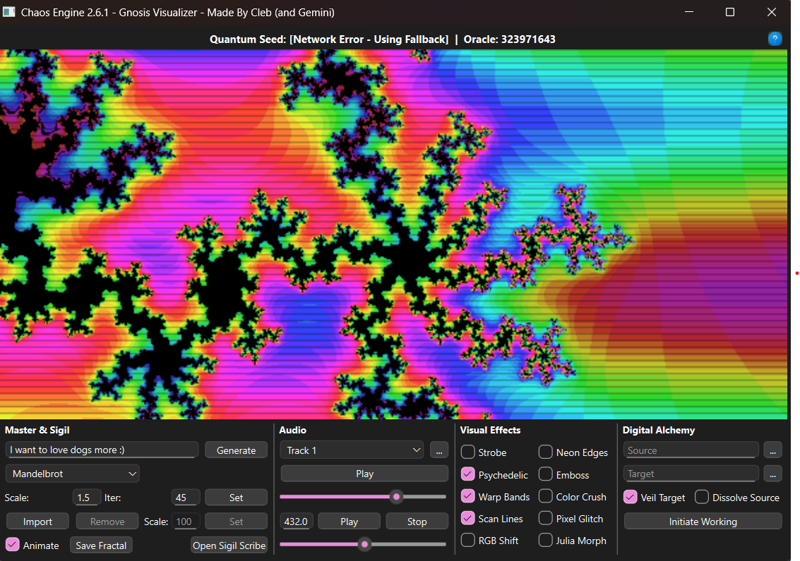

<div align="center">
  <h1>The Chaos Engine - Digital Ritual Chamber and Gnosis Visualizer</h1>
  
</div>

---

## 🔮 Overview

The Chaos Engine (v2.6.1 - "The Resilient Oracle") is a unique, multi-faceted application designed as a digital tool for **Chaos Magick**, meditation, and exploring the chaotic beauty of fractals. It combines dynamic fractal generation with real-time visual and audio effects, a quantum-influenced "Oracle" for generating true randomness, and a symbolic "Digital Alchemy" system for file manipulation.

Crafted for those who wish to externalize their intent and experiment with digital ritual, the Chaos Engine provides a rich, interactive environment for both visual exploration and symbolic workings.

## ✨ Features

### 1. Fractal Generation & Visualization

*   **Diverse Fractal Types:** Explore the intricate beauty of **Mandelbrot**, **Julia**, and **Burning Ship** fractals.
*   **Dynamic Rendering:** Fractals are continuously generated and updated, responding to user input and animated sequences.
*   **Intuitive View Control:**
    *   **Panning:** Effortlessly drag the fractal to navigate vast mathematical landscapes.
    *   **Zooming:** Seamlessly zoom in and out using the mouse wheel, revealing infinite detail.
    *   **Intent-Based Generation:** Input any text ("Intent") to seed fractal parameters. This intent is hashed to generate unique fractal views, acting as a powerful symbolic generator.
*   **Performance Optimization:**
    *   **Render Scale:** Adjust the internal rendering resolution for a balance of detail and performance.
    *   **Max Iterations:** Fine-tune the depth and complexity of the fractal calculations.
*   **High-Resolution Export:** Save your favorite fractal formations as high-quality `1920x1080` images.

### 2. Real-time Visual Effects

Elevate your fractal experience with a rich array of toggleable real-time visual effects. Each effect comes with randomized parameters upon activation for endless variations:

*   **Strobe:** Rapidly cycle through various color palettes for intense visual shifts.
*   **Psychedelic Colors:** Immerse yourself in a dynamic, trippy HSV-based coloring scheme that evolves with time.
*   **Warp Bands:** Introduce mesmerizing horizontal distortions, creating a flowing, liquid-like effect.
*   **Scan Lines:** Add a nostalgic, retro CRT display aesthetic.
*   **Neon Edges:** Highlight the fractal's intricate boundaries with glowing, neon-like contours using a Sobel filter.
*   **Emboss:** Give the fractal a tactile, three-dimensional appearance with an emboss filter.
*   **RGB Shift:** Generate a subtle or pronounced chromatic aberration effect by shifting color channels.
*   **Color Crush:** Reduce the color palette, resulting in a distinct posterized or pixelated look.
*   **Pixel Glitch:** Introduce random, momentary distortions at the pixel level for an unpredictable aesthetic.
*   **Julia Morph:** (For Julia Sets) Subtly animate the 'c' parameter, causing the Julia fractal to continuously morph and flow.
*   **Tunnel Vision:** Create a focused, dream-like effect by gradually darkening the fractal towards the edges.

### 3. Fractal Animation

*   **Continuous Journey:** Enable a captivating animation mode that automatically pans and zooms through the fractal, offering a dynamic and evolving visual experience.
*   **Synchronized Effects:** Many visual effects are designed to interact with the animation timeline, producing complex, synchronized changes.

### 4. Sigil Integration

*   **Import Custom Sigils:** Overlay your personal sigils, symbols, or images (PNG, JPG, GIF) directly onto the fractal display.
*   **Adjustable Scaling:** Precisely control the display size of your imported sigil.
*   **Dynamic Placement:** Activate a "flashing" mode where your sigil randomly repositions itself across the screen at set intervals, imbuing it with chaotic energy.
*   **Launch Sigil Scribe:** A dedicated button to launch "The Sigil Scribe.py" (an external script in the same directory), providing a pathway to creating or managing your sigils.

### 5. Immersive Audio

*   **Background Music Player:**
    *   **Predefined Tracks:** Enjoy a selection of integrated ambient or energetic music tracks.
    *   **Custom Audio Upload:** Import your own MP3, WAV, or OGG files to personalize your audio backdrop.
    *   **Full Playback Control:** Standard play, pause, and volume controls for your chosen music.
*   **Frequency Tone Generator:**
    *   **Harmonic Tones:** Input specific frequencies (e.g., 432 Hz) to generate pure sine wave tones.
    *   **Volume Control:** Adjust the intensity of the generated tone.
    *   **Play/Stop Functionality:** Direct control over the tone's playback.

### 6. Quantum Oracle (Currently Under Maintenance)

**NOTICE: The "Quantum Oracle" feature is currently experiencing issues with fetching true random numbers from the ANU Quantum Server. While the system gracefully falls back to a high-quality pseudo-random generator, we are actively working on a fix to restore the true quantum randomness in the next version update.**

*   **Dual Oracle System:** Displays two critical numbers for ritual work:
    *   **Quantum Seed (Currently Fallback):** Intended to be a true random number fetched from the ANU Quantum Server (currently using a high-quality pseudo-random fallback). This serves as the non-deterministic anchor. The system will notify you if it's using the fallback.
    *   **Oracle:** A rapidly fluctuating number, updated every second. It combines the current "Quantum Seed" with the system's millisecond timestamp and processes it through a cryptographic hash, yielding a wildly unpredictable value.
*   **Insightful Help Guide:** A detailed explanation on how to leverage the "Dual Oracle" in Chaos Magick practices:
    *   **Breaking Patterns:** Utilize the rapidly changing **Oracle** for focused meditation.
    *   **Sigil Charging:** Gaze upon the **Oracle** to infuse sigils with chaotic potential.
    *   **Divination:** Use the **Oracle** number for symbolic interpretations (e.g., numerology, tarot card selection).
    *   **Ritual Seed:** Employ the (intended) truly random **Quantum Seed** to influence core ritual elements.

### 7. Digital Alchemy

Engage in symbolic file manipulation rituals with the "Digital Alchemy" module:

*   **Source of Intent:** Designate a source folder containing files representing your intent or energy.
*   **Ritual Space (Target):** Select a target folder, your digital "ritual space."
*   **Initiate Working:** Copy the contents of your Source to your Target.
*   **Veil Target:** (Optional) Rename the Target folder to a randomly generated alphanumeric "glyph," symbolically veiling or protecting the working.
*   **Dissolve Source:** (Optional) Delete the original Source folder after copying, symbolizing the dissolution or transformation of the initial state.
*   **Robust Error Handling:** Includes checks for valid paths and prevents paradoxical operations (e.g., source and target being the same).
*   **Asynchronous Operations:** All "workings" are performed in a background thread to maintain UI responsiveness.

## 🚀 Getting Started

### Prerequisites

*   Python 3.x
*   `PySide6`
*   `numpy`
*   `numba`
*   `requests` (Required for Quantum Oracle - if missing, fallback to pseudo-random will occur)
*   `pygame` (Required for Music Playback - if missing, music features will be disabled)
*   `sounddevice` (Required for Tone Generation - if missing, tone features will be disabled)

### Installation

1.  **Clone the repository:**
    ```bash
    git clone https://github.com/clebmb/chaos-engine.git
    cd chaos-engine
    ```
2.  **Install dependencies:**
    ```bash
    pip install PySide6 numpy numba requests pygame sounddevice
    ```
    *(Note: `numba` may require a C++ compiler like MinGW or Visual Studio Build Tools)*

### Running the Application

```bash
python "Chaos Engine v.2.0.py"
